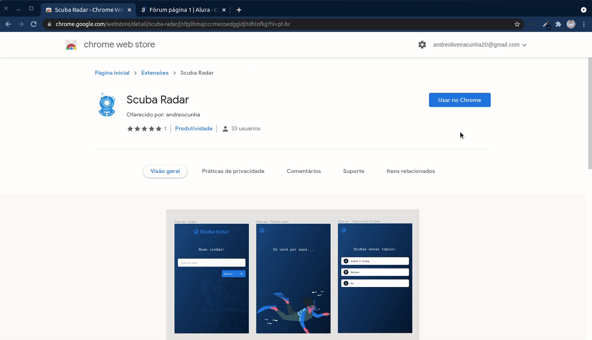

# Scuba Radar
### Extensão do Scuba Team Alura


## :information_source: O que é o Scuba Radar?

O Scuba Radar é uma extensão para navegadores baseados no chrome que a intuito de alertar as pessoas se já existe alguém respondendo um determinado tópico no fórum da Alura, evitando respostas duplicadas. A ideia da extensão surgiu em brainstorming no Scuba Team e ela foi desenvolvida em uma prática interna no time.


<h1 align="center">
    
</h1>


## :rocket: Tecnologias

Esse projeto foi desenvolvido usando as seguintes tecnologias:

- [Node.js][nodejs]
- [Chrome Extensions][chrome]
- [HTML][html]
- [CSS][css]
- [JavaScript][javascript]

## :information_source: Como usar

Para copiar e executar essa aplicação você precisa do [Git](https://git-scm.com), [Node.js][nodejs] intalado no seu computador.

No terminal digite:

### Instalar API (backend)

```bash
# Clonar esse repositório
$ git clone https://github.com/andreocunha/scuba-forum-extension

# Vá para o ropositório
$ cd scuba-forum-extension/backend

# Instale as dependências
$ npm install

# Iniciar o servidor
$ npm run dev

# running on port 4000
```

### Extensão

```bash
# Clonar esse repositório
$ git clone https://github.com/andreocunha/scuba-forum-extension

# Vá para o ropositório
$ cd scuba-forum-extension/scuba-radar

# Para executar a extensão basta ativar o modo desenvolvedor no navegador e arrastar a pasta "scuba-radar" para instalar
```


Feito com ♥ por André Oliveira Cunha :wave: [Linkedin](https://www.linkedin.com/in/andr%C3%A9-oliveira-cunha-b26b3a156/)

[nodejs]: https://nodejs.org/
[chrome]: https://developer.chrome.com/docs/extensions/
[html]: https://developer.mozilla.org/pt-BR/docs/Web/HTML
[css]: https://developer.mozilla.org/pt-BR/docs/Web/CSS
[javascript]: https://developer.mozilla.org/pt-BR/docs/Web/JavaScript